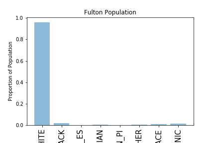
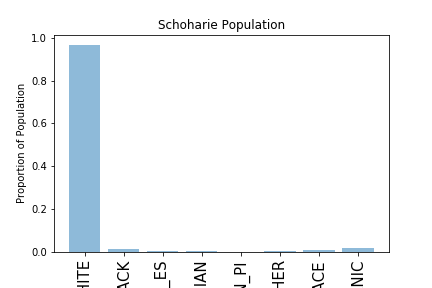

**Assignment 1**

This project looked at MTA rider type as a time series. I first visualized the average number of rides per week, then looked at the rolling average to identify trends. Then used Random Forrest Classifier to predict rider type based on the time series. 

I worked on this with a few people here and there. For questions 1 & 2 I worked with Angel and Rohun, where Tanya helped with the elegant solution of avoiding a double for loop by transposing our array. Specific contributions are marked in the notebook. For problem 3 I had some more troube, luckily Rufei was able to help me understand a neat way to break down the array into a dataframe and label accordingly. Apologies for the messy ending and lack of conclusion. :(

**Assignment 2**

I used the feedback from the graph creation in a previous assignment to create two totally new graphs. The thoughtful feedback I recieved suggested to include the white population and also to not do a stacked barchart because these are tricky to read. My objective was to represent the data demographics with the white population in a way that shows the disparaty in diversity.

This looks at the demographic breakdown in Fulton County. We see the highest demographic population is White. This is similar to the other county Schoharie as pictured below.

