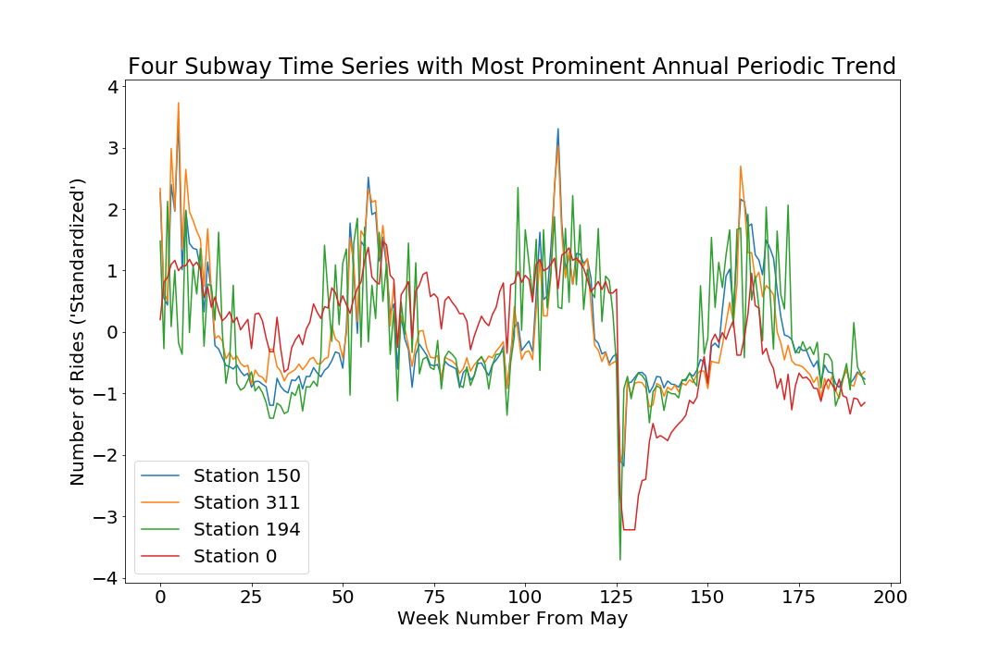

**assignment 1**

This was an extension of last week's assignment where we looked at the time series of MTA data for the different user types. This time, we performed a Fourier transformation to identify the 4 subway stations with the strongest periodicity in a year. Shown below:

Then I looked at other cycles that might be stronger than those we see at 1 year, but not what the question is asking...which is to find the strongest **annual** periodicity

We took the average along a period of 52 weeks in a year and found the 4 stations with the highest prominent periodic trend. It seems that every 10 weeks there is a cycle in ridership, when it seems there is a drop in ridership. This is perhaps to how holidays are lined up throughout the year, for example...where about 10 weeks after Columbus Day, it is Thanksgiving and both cause a decrease in ridership. 

I worked on this assignment with a few different people throughout the assignment. At first I worked with Rohun Iyer to format the data cube of MTA ridership into the proper format, using the % to break down the index by 52 and then taking the average when we grouped. 

Later I worked with Angel Liu to find the maximum power value in our Fourier transformations which identified the stations with the most prominent periodic trend.

Then finally to get the correct answer of annual periodicity I worked alone on the code.

**assignment 2**

This assignment practiced clustering on data from the Census Bureau Business Data for all years 1993-2014. I downloaded the data from professor Bianco's repository for each year and then concatenated to find the number of establishments per year and per zip code. Then using a shapefile from NYC Open Data we downloaded the zipcodes shapefile to create a choropleth of each cluster.

Using k-means clustering I decided an optimal number of means of 6.

I began to work on this assignment with Andrew Hill to collect the data in a programatic way. Urusula helped me with the unstack function to make each year into a pivot table. Then I worked on my own to make the choropleths.

